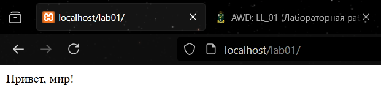
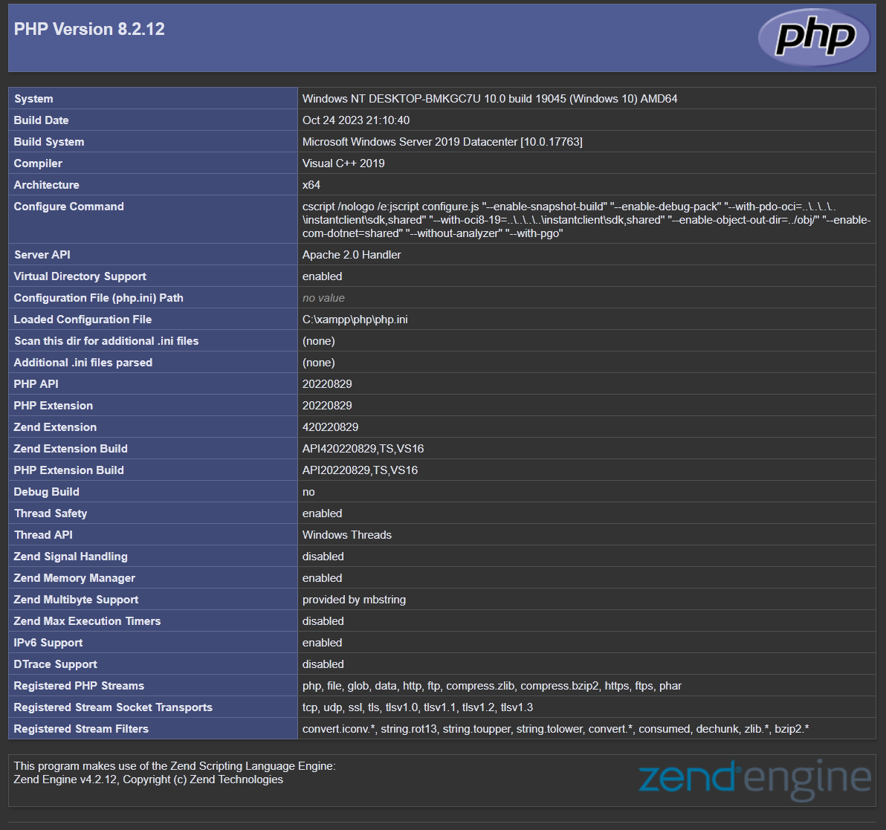

# Лабораторная работа №1: Установка и первая программа на PHP

# Цель работы

Целью данной лабораторной работы является установка и настройка среды разработки для работы с языком программирования PHP, а также создание первой программы на PHP.
# Установка PHP
Я выбрал вариант установки, используя XAMPP. Установка быстрая, простая и работает без вмешательства пользователя, кроме одного - пришлось отключить UAC в Windows.

# Написание первой PHP-программы

Программа:
```php
<?php

echo "Привет, мир!";
?>
```

# Работа с переменными и выводом
Объявляются переменные с использованием символа `$` и названием переменной.
Чтобы вывести сообщение можно использовать `echo` или `print`.
Конкатенация осуществляция посредствием вставки `.` между строками/переменными.
Интерполяцию можно осуществить сразу в строке с использованием двойных кавычек.
```php
<?php
$days = 288;
$message = "Все возвращаются на работу!";

echo "Осталось " . $days . " дней. " . $message . "<br>";

echo "Осталось $days дней. $message<br>";
?>
```

# Контрольные вопросы
### 1. Какие способы установки PHP существуют?
PHP можно установить скачав исходный код и распаковав его на диске, а после прописав в `PATH` путь до папки или же использовать XAMPP и установить сразу всю среду.
### 2. Как проверить, что PHP установлен и работает?
Если PHP был установлен первым способом, то достаточно открыть `cmd` и написать: `php -v`, чтобы узнать текущую установленную версию PHP. В случае же с XAMPP достаточно пройти по адресу `http://localhost/dashboard/phpinfo.php` и просмотреть версию PHP.


### 3. Чем отличается оператор `echo` от `print`?

|                            |             `echo`              |   `print`    |
| -------------------------: | :-----------------------------: | :----------: |
|       **возвращает значение?** |                x                | возвращает 1 |
|                 **аргументы?** |     несколько через запятую     |      x       |
|                  **скорость?** | быстрее, не возвращает значение |  медленнее   |
| **используется в выражениях?** |                x                |      v       |
Лучше всего использовать `echo`, он проще и надежнее.

# Вывод
В ходе этой лабораторной работы я смог установить среду разработки для PHP и создавать простые программы через `index.php`, используя базовый синтаксис, что в дальнейшем позволить продолжить обучение PHP без сложностей.